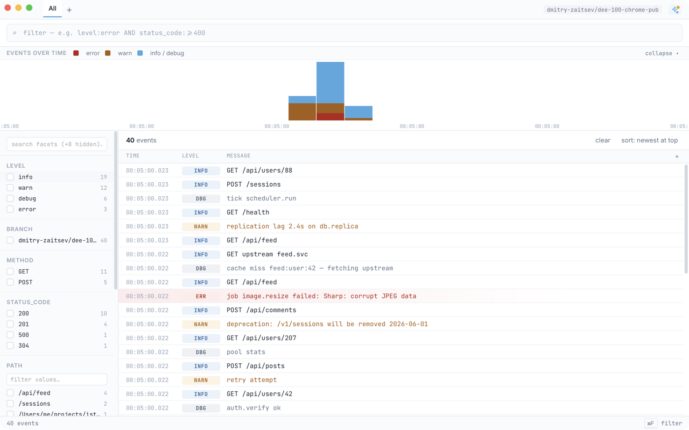

# istoria

[](LICENSE)

Local log viewer — pipe stdout into a native window.



A native macOS app that swallows whatever your process prints, indexes it in
DuckDB, and gives you query, facets, alerts, and saved views over the stream.
Pair with the Chrome extension to fold browser console + network events into
the same timeline as your backend logs.

## Features

- **Stdin capture** — `your-command | istoria` and the running app picks it up.
  Multi-pipe forwarders so several producers feed one window.
- **Browser logs extension** — opt-in per-tab capture of `console.*`, uncaught
  exceptions, and network metadata. Forwards over loopback only.
- **Query language** — filter by source, level, regex, or structured fields
  parsed from JSON log lines.
- **Facets** — group + count by any field on the fly.
- **Alerts** — define rules that fire native notifications when matching events
  arrive.
- **Saved views** — pin filter / facet combinations and switch between them.
- **MCP** — `istoria` also serves as MCP that your local agents can connect to and read the logs of an already running process.

## Install

Preferred: grab the signed `.dmg` and drag `istoria.app` to `/Applications`.

[Download istoria.dmg](https://github.com/dmitry-zaitsev/istoria-releases/releases/latest/download/istoria.dmg)

The app verifies its own signature and one-click auto-updates itself going forward.

Alternative — Homebrew:

```sh
brew install dmitry-zaitsev/tap/istoria
```

Brew users update via `brew upgrade`.

macOS Apple Silicon only. See [`RELEASING.md`](RELEASING.md) for why.

## Usage

```sh
echo "hello world" | istoria
```

Or pipe a long-running process:

```sh
your-server 2>&1 | istoria
```

Or replay a log file:

```sh
cat examples/sample_log.txt | istoria
```

JSON log lines have their fields lifted into structured columns
automatically. Plain text lines still work — they just get fewer
auto-extracted facets.

## Browser extension

Stream `console.*` + network events from any tab into the same window.

See [`extension/README.md`](extension/README.md) for install + usage.
Privacy policy: [`extension/PRIVACY.md`](extension/PRIVACY.md).

## Build from source

```sh
just bootstrap         # installs JS deps + sccache + lld
just dev               # tauri dev with hot reload
```

Or directly:

```sh
npm install
npm run tauri dev
```

For the extension:

```sh
cd extension && npm install && npm run build
```

## Releasing

See [`RELEASING.md`](RELEASING.md). One-button release via GitHub Actions →
Homebrew tap.

## License

[MIT](LICENSE) © Dmitry "Dima" Zaytsev
