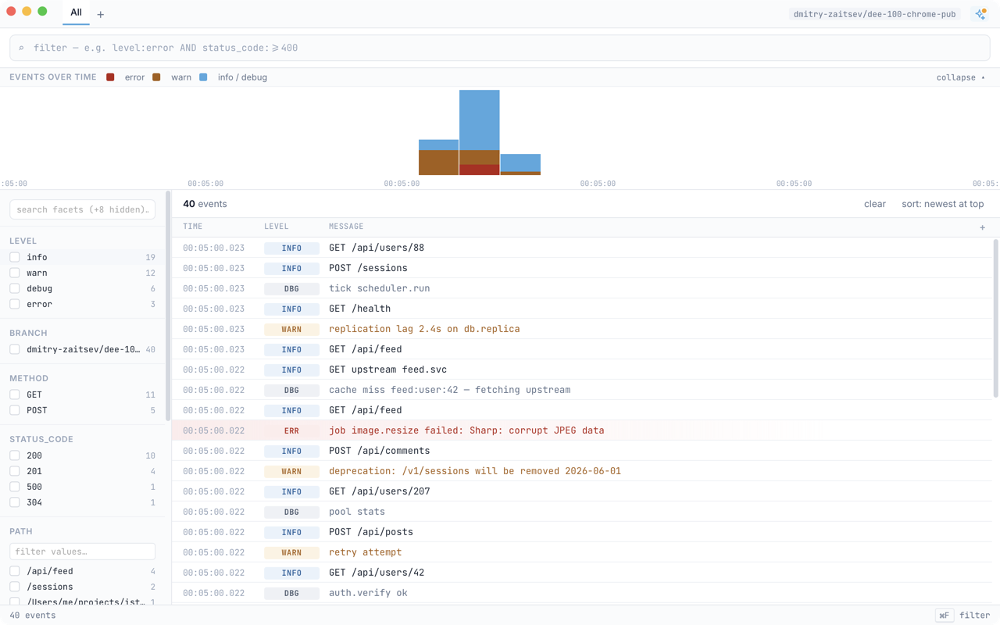

# istoria

[](LICENSE)

Local log viewer — pipe stdout into a native window.



A native macOS app that swallows whatever your process prints, indexes it in
DuckDB, and gives you query, facets, alerts, and saved views over the stream.
Pair with the Chrome extension to fold browser console + network events into
the same timeline as your backend logs.

## Features

- **Stdin capture** — `your-command | istoria` and the running app picks it up.
  Multi-pipe forwarders so several producers feed one window.
- **Browser logs extension** — opt-in per-tab capture of `console.*`, uncaught
  exceptions, and network metadata. Forwards over loopback only.
- **macOS system logs (experimental)** — opt-in live unified logs (the same
  logging system used by Console) under the `macos` source.
- **Query language** — filter by source, level, regex, or structured fields
  parsed from JSON log lines.
- **Facets** — group + count by any field on the fly.
- **Alerts** — define rules that fire native notifications when matching events
  arrive.
- **Saved views** — pin filter / facet combinations and switch between them.
- **MCP** — `istoria` also serves as MCP that your local agents can connect to and read the logs of an already running process.

## Install

Preferred: grab the signed `.dmg` and drag `istoria.app` to `/Applications`.

[Download istoria.dmg](https://github.com/dmitry-zaitsev/istoria-releases/releases/latest/download/istoria.dmg)

The app verifies its own signature and one-click auto-updates itself going forward.

Alternative — Homebrew:

```sh
brew install dmitry-zaitsev/tap/istoria
```

Brew users update via `brew upgrade`.

macOS Apple Silicon only. See [`RELEASING.md`](RELEASING.md) for why.

## Usage

```sh
echo "hello world" | istoria
```

Or pipe a long-running process:

```sh
your-server 2>&1 | istoria
```

Or replay a log file:

```sh
cat examples/sample_log.txt | istoria
```

JSON log lines have their fields lifted into structured columns
automatically. Plain text lines still work — they just get fewer
auto-extracted facets.

## Settings

Open **Settings** with the gear button at the top right, **⌘,** (Ctrl+, on other
platforms), or the macOS app menu. Preferences are saved automatically on this
Mac and take effect immediately, without restarting the app. Choose a group in
the left sidebar, then adjust its controls on the right. **General** includes
log order; **Experimental** contains opt-in features. Hover over or focus a
setting’s info icon for details.

### Experimental: macOS system logs

System log capture is **off by default**. Enable **Settings → Experimental →
macOS system logs** to start `/usr/bin/log stream`. New system log messages
appear under `source:macos`, alongside piped and browser logs. No separate
terminal command or open Console window is needed.

The preference persists across launches and applies to both app shells. Turning
it off stops the collector immediately and keeps already captured logs. Quitting
the app also stops the collector; attaching another pipe does not start another
collector. Experimental features remain off if saved settings cannot be read.

Original timestamps, severity, and metadata are preserved. Filter with
`source:macos`, `source:macos level:error`, `source:macos process:Finder`, or
`source:macos subsystem:com.example.app`. Process IDs, categories, and image
paths are also available as structured fields. Apple `Fault` and `Error` map
to Istoria's error level; `Default` and `Info` map to info.

Capture starts when enabled, without replaying historical logs. The default level
includes default, error, and fault messages. System logs share the bounded
in-memory buffer with other sources, so a busy system can evict older entries
sooner. Use `NOT source:macos` to hide them. Advanced capture options can be set
with environment variables **before launching the app** (they do not enable
capture; the Settings opt-in is still required):

| Variable                       | Default   | Purpose                                                  |
| ------------------------------ | --------- | -------------------------------------------------------- |
| `ISTORIA_SYSTEM_LOG_LEVEL`     | `default` | Set to `info` or `debug` to include more verbose events. |
| `ISTORIA_SYSTEM_LOG_PREDICATE` | none      | Native macOS log predicate, e.g. `process == "Finder"`.  |

For example, during development (then enable capture in Settings):

```sh
ISTORIA_SYSTEM_LOG_PREDICATE='process == "Finder"' npm run electron
```

The collector runs with your existing permissions and preserves macOS privacy
redaction (`<private>`); it does not request elevated access. Capture errors appear
as warning events in the `macos` source, with retries backing off to once per
minute. These logs are available through the same local query and MCP interfaces
as other captured logs. Other operating systems do not start this collector.

## Browser extension

Stream `console.*` + network events from any tab into the same window.

See [`extension/README.md`](extension/README.md) for install + usage.
Privacy policy: [`extension/PRIVACY.md`](extension/PRIVACY.md).

## Build from source

```sh
just bootstrap         # installs JS deps + sccache + lld
just dev               # Electron + Rust core with hot reload
```

Or directly:

```sh
npm install
npm run electron:dev
```

For the extension:

```sh
cd extension && npm install && npm run build
```

## Releasing

See [`RELEASING.md`](RELEASING.md). One-button release via GitHub Actions →
Homebrew tap.

## License

[MIT](LICENSE) © Dmitry "Dima" Zaytsev
